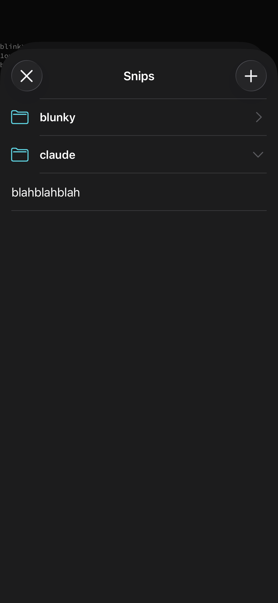
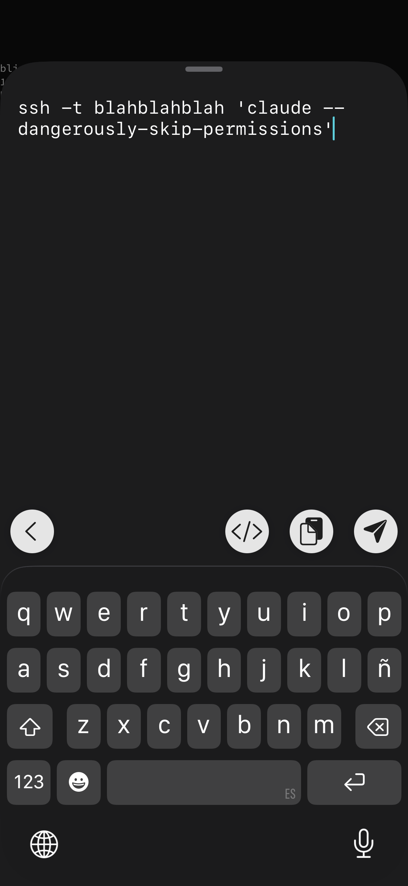
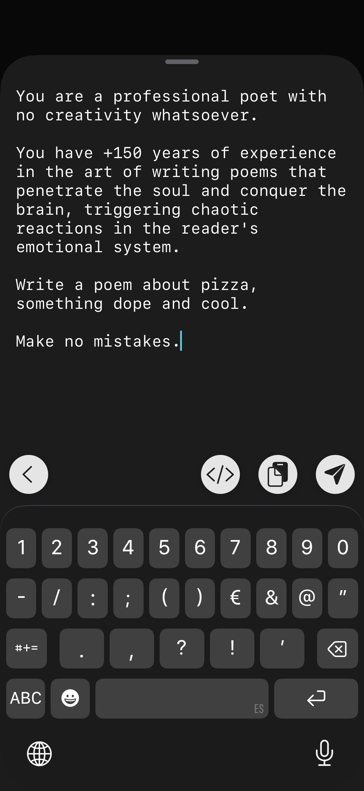
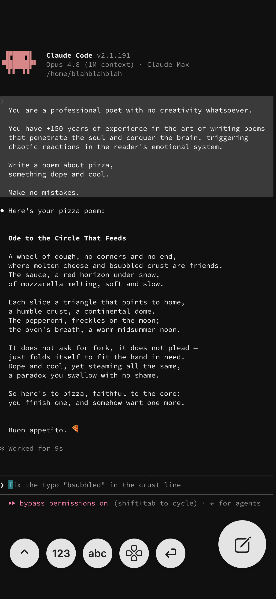

# Blunk

### 📱🤖 The iPhone terminal for **remote agentic coding.**

Your AI agent — Claude Code, say — runs on a real machine somewhere: a server, a VM, the beefy desktop back home. **Blunk is the comfiest way to reach it over SSH/Mosh and drive it from your phone.** Kick off a run on the train, approve a diff from the couch, fix the typo in your prompt while the coffee brews.

It's a fork of [Blink Shell](https://blink.sh), built to scratch a specific itch: I wanted **room to write calmly** without my message getting buried in the scrollback, **voice dictation** that actually works for handing an agent instructions, a **minimalist interface** with nothing I'll never touch, and a **gallery of quick snippets** to hop onto my servers and run maintenance. So Blunk rethinks the one thing a desktop terminal never had to worry about: *typing a lot — comfortably — to an agent living in a `tmux` pane somewhere.* No more texting your AI with oven mitts on. 🧤

> 💙 **All love to the [Blink](https://blink.sh) team.** Blink is a superb, full-featured terminal, and every bit of it is still here under Blunk — none of this would exist without their work. This fork isn't out to compete with Blink or replace it; it's just a more opinionated, agentic-coding-first take on the input side. If you want the real, complete deal, go grab Blink and support the folks who built it. 🙌

<table>
<tr>
<td></td>
<td></td>
<td></td>
<td></td>
</tr>
<tr>
<td align="center"><b>Snippets</b></td>
<td align="center"><b>Connect to your server</b></td>
<td align="center"><b>Space to edit</b></td>
<td align="center"><b>Enjoy agentic coding!</b></td>
</tr>
</table>

## Why Blunk?

A stock terminal hands you a tiny keyboard under an 80-column wall of text and wishes you luck. That's fine for a quick `git pull`. It's misery for telling an agent, in three thoughtful paragraphs, exactly what you want — and then fixing the typo in the middle. So Blunk flips the input model:

- **A real composer, not a cramped prompt line.** Tap `✎` for **Blunkitor**, a full-screen editor with room to *think*: write long prompts, dictate them, scroll back and fix a word without rage-tapping. Send to the agent with one tap or `Ctrl+Enter`. The terminal itself stays a clean, read-only transcript you can scroll and copy from.
- **Common keys, one tap away.** **Blunkeys** are floating round quick-keys that fire *live* to the TUI — `Esc`, `Tab`, `Ctrl-C` and the rest of the readline keys agents love, plus digits, letters, and a proper circular arrow d-pad. No spelunking through submenus for `Esc` while your agent waits.
- **Live command completion**, so `--dangerously-skip-permissions` is a tap, not a spelling test.
- **Snippets in tidy folders.** Stash the incantations you always retype (`ssh -t box 'claude …'`) and drop them into the composer instantly.
- **Bring your own Bluetooth keyboard.** A single keystroke goes straight to the agent (so TUIs can react to `y`/`n`); start typing a word and Blunk hands off to the composer on its own.

It's still Blink under the hood — Mosh's rock-solid always-on connection, SSH, hterm rendering, your keys and hosts, untouched. Blunk only swaps the input model, behind a single flag (`Blunk.scratchOnly`); flip it off and you're back to stock Blink.

Built and run from source on my own device — GPLv3, same as Blink. Build, deploy and architecture notes live in [`CLAUDE.md`](CLAUDE.md). The original Blink README follows.

---

# Blink Shell for iOS
Do Blink! [Blink](https://blink.sh) is the first professional, desktop-grade terminal for iOS that leverages the support of Mosh and SSH. Thus, we can unequivocally guarantee stable connections, lightning-fast speeds, and full configurations. It can and should be your all-day-long tool.

We did not create another terminal to fix your website on the go. Blink was built as a professional grade product from the onset. We started by analyzing what the must-haves were and we ended up grounding Blink on these three concepts:
- Fast rendering: dmesg in your Unix server should be instantaneous. We can't wait even a second to render. We didn't need to reinvent the wheel to make this happen. We simply used Chromium's HTerm to ensure that rendering is perfect and fast, even with those special, tricky encodings.
- Always on: Mosh transcends SSH's variability. Mosh overcomes the unstable and intermittent connectivity that we all associate with mobile connections. You can check your Safari without fear of having to restart the SSH connection. You can flawlessly jump from home, to the train, and then the office thanks to Mosh. Blink is rock-solid connected all the way. Mosh is readily available and can be easily installed on your server. Go to https://mosh.org. 
- Fully configurable: Blink embraces Bluetooth-coupled keyboards with gusto. Some like Caps as Esc on Vim, others Caps as Ctrl on Emacs. Blink champions them all. But there's more, because we want more. You can also add your own custom themes and fonts to Blink. During your always-on sessions, you're in your zone.

But, Blink is much more. Please read on:
- You should command your terminal, not navigate it. Blink will jump you right into a friendly shell and it'll be clear to you how to roll.
- The interface is straightforward. We dumped all menus and went full screen for your terminal.
- Use swipe to move between your open connections, slide down to close them, and even pinch to zoom!
- Configure your Blink connections by adding your own Hosts and RSA Encryption keys. Everything will look familiar and you get to work, fast!
- We've incorporated SplitView, for those necessary Google searches and chats with coworkers.

For more information, please visit [Blink Shell](https://blink.sh).

# Additions: 

Blink also contains a set of shell utilities, so you can add / remove files, list them, etc.

Specifically, the commands available (as of now) are:

* cd, setenv, ls, touch, cp, rm, ln, mv, mkdir, rmdir, 
df, du, chksum, chmod, chflags, chgrp, stat, readlink, 
compress, uncompress, gzip, gunzip,
* pwd, env, printenv, date, uname, id, groups, whoami, uptime
* cat, grep, wc
* curl (includes http, https, scp, sftp...), scp, sftp
* tar 

* You can call commands individually, or use small scripts using python or lua. There is redirection (">", "<", "&>" ...), but no pipe. 

All these commands are inside the `ios_system.framework` (precompiled, for facility). If you want to edit the source (to add more commands), see: https://github.com/holzschu/ios_system. 

curl opens access to file transfers to and from your iPad (ftp, http, scp, sftp...). It uses the key management of BLINKSHELL  (the keys you created with "config"). You can also specify keys with a path:
```
curl scp://host.name.edu/filename -o filename --key $SHARED/id_rsa --pass MyPassword 
```
You can also use the scp and sftp commands:
```
scp user@host.name.edu:filename . 
sftp localFilename user@host.name.edu:~/ 
```

scp and sftp are implemented through curl, by rewriting the arguments to follow the curl syntax. Pro: lighter implementation, smaller memory cost, less likely to have function name collisions. Con: some switches might not have exactly the same meaning. 

# Environment variables

In iOS, because of sandbox restrictions, you cannot write in the `~` directory, only in `~/Documents/`, `~/Library/` and `~/tmp`. Most Unix programs assume the configuration files are in `$HOME`. 
So either you redefine `$HOME` to `~/Documents/` or you set configuration variables (using `setenv`) to some other place.

I do this in Blink, inside the `MCPSession.m` file. The following variables are defined:
```bash
setenv PATH = $PATH:~/Library/bin:~/Documents/bin
setenv PYTHONHOME = $HOME/Library/
setenv SSH_HOME = $HOME/Documents/
setenv CURL_HOME = $HOME/Documents/
setenv HGRCPATH = $HOME/Documents/.hgrc/
setenv SSL_CERT_FILE = $HOME/Documents/cacert.pem
```

If you want to change them permanently, it's probably best to edit `MCPSession.m`.

# Obtaining Blink
Blink is available now on the [AppStore](https://itunes.apple.com/app/id1156707581). Check it out!

If you would like to participate on its development, we would love to have you on board! There are two ways to collaborate with the project: you can download and build Blink yourself, or you can request an invitation to help us test future versions (on the raw branch). If you want to participate on the testing, follow and tweet us [@BlinkShell](https://twitter.com/BlinkShell) about your usage scenarios. Invitations will be sent out in waves, please be patient if you do not receive yours immediately.

Bugs should be reported here on GitHub. If you have any questions or want to make sure we do not miss on an interesting feature, please send your suggestions to our Twitter account [@BlinkShell](https://twitter.com/BlinkShell). We would love to discuss them with you! Please do not use Twitter to report bugs.

We can't wait to receive your valuable feedback. Enjoy!

## Build


We made a ton easier to build and install Blink yourself on your iOS devices through XCode. We provide a precompiled package with all the libraries for the master branch. Here are the steps:

0. Check `xcode-select -p` is pointing to Xcode.app (`/Applications/Xcode.app/Contents/Developer`) not command tools.

1. Run the following command:
```bash
git clone --recursive https://github.com/blinksh/blink.git && \
    cd blink && ./get_frameworks.sh && ./get_resources.sh && \
    rm -rf Blink.xcodeproj/project.xcworkspace/xcshareddata/
```

2. Change developer ids

```bash
cp template_setup.xcconfig developer_setup.xcconfig
```

edit developer_setup.xcconfig (change apple developer id etc).

3. Open the project in XCode

3a. If you want to build without iCloud, Push Notificationa and/or Keychain sharing, Before doing anything else, go into the capabilities for the project and turn off Push Notifications, iCloud, and Keychain Sharing

4. Connect the device you want to build for and select it in Product -> Destination
5. Build and run on the device

This will download Blink and the associated frameworks: `libssh2`, `OpenSSL`, `libmoshios`, `protobuf` and `ios_system`. 

Although this is the quickest method to get you up and running, if you would like to compile all libraries and resources yourself, refer to the [BUILD.md](BUILD.md) file. Please let us know if you find any issues. Blink is a complex project with multiple low level dependencies and we are still looking for ways to simplify and automate the full compilation process.

# Using Blink
Our UI is very straightforward and optimizes the experience on touch devices for the really important part, the terminal. You will jump right into a very simple shell, so you will know what to do. Here are a few more tricks:
- Type 'help' to find information at the shell.
- Use two fingers tap to create a new shell.
- Move between shells by swiping your finger.
- You can exit the session and get back to the shell to open a new connection.
- Use pinch gesture to increase or reduce size of text. You can also use Cmd+ or Cmd- if using the keyboard.
- Copy and Paste by selecting text o tapping the screen.
- Run 'config' to setup your keys. Install them to a server through ssh-copy-id.
- Ctrl and Alt modifiers at the SmartKeys bar allow for continuous presses, like in a real keyboard.
- Use 3 finger tap to menu.

# Changelog

[View all changes](CHANGELOG.md)

# Attributions
- [Mosh](https://mosh.org) was written by Keith Winstein, along with Anders Kaseorg, Quentin Smith, Richard Tibbetts, Keegan McAllister, and John Hood.
- This product includes software developed by the OpenSSL Project
for use in the OpenSSL Toolkit. (https://www.openssl.org/).
- [Libssh2](https://www.libssh2.org)
- Entypo pictograms by Bruce Daniel www.entypo.com.
